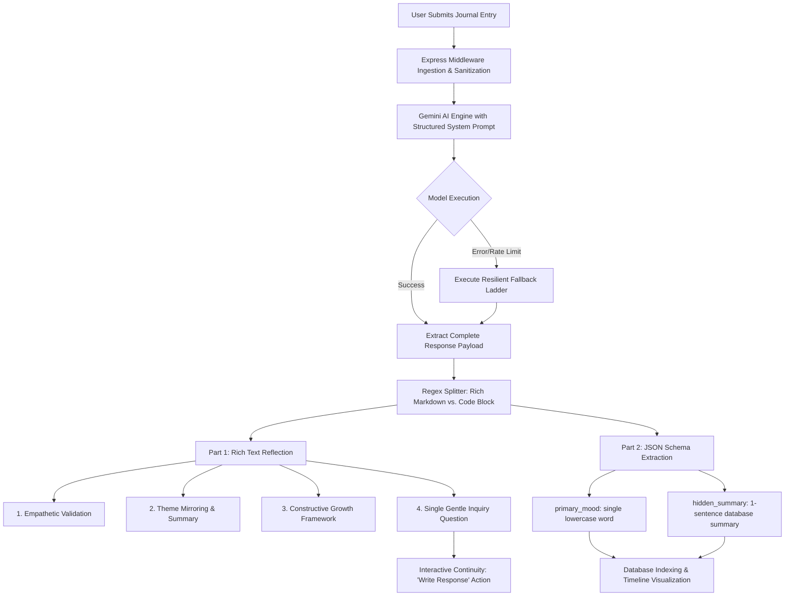
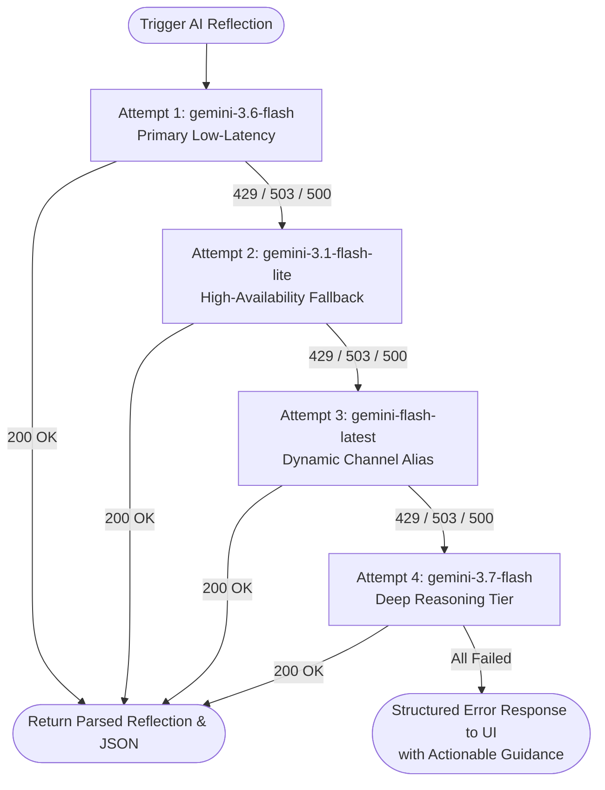

# Aura Journal — Empathetic & Insightful AI Journaling Assistant

Aura Journal is a production-grade, empathetic, and insightful AI journaling companion built with **React**, **TypeScript**, **Tailwind CSS**, **Express**, and the **Google Gen AI SDK (`@google/genai`)**. It is architected to help users process thoughts, validate complex emotions, discover constructive frameworks for personal challenges, and maintain a structured, searchable history of personal growth.

---

## 📑 Table of Contents
1. [System Architecture & Flow Diagrams](#-system-architecture--flow-diagrams)
   - [End-to-End Processing Architecture](#1-end-to-end-processing-architecture)
   - [Two-Part Response Pipeline Flowchart](#2-two-part-response-pipeline-flowchart)
   - [Resilient Model Fallback Ladder Flowchart](#3-resilient-model-fallback-ladder-flowchart)
2. [Core AI System Behavior](#-core-ai-system-behavior)
3. [Repository Structure & Project Guide](#-repository-structure--project-guide)
4. [Local Setup & Testing Guide](#-local-setup--testing-guide)
   - [Prerequisites](#prerequisites)
   - [Quick Start in 4 Steps](#quick-start-in-4-steps)
   - [Step-by-Step Local Test Matrix](#step-by-step-local-test-matrix)
5. [Agentic Threat Modeling & Security Architecture](#-agentic-threat-modeling--security-architecture)
6. [Cloud Firestore Security Rules](#-cloud-firestore-security-rules)
7. [Production Deployment to Google Cloud Run](#-production-deployment-to-google-cloud-run)
   - [Secret Manager Integration](#1-secret-management-setup)
   - [Container Deployment & Campaign Labeling](#2-cloud-run-deployment-flow)

---

## 📊 System Architecture & Flow Diagrams

### 1. End-to-End Processing Architecture

```
┌─────────────────────────────────────────────────────────────────────────┐
│                           CLIENT BROWSER (SPA)                          │
│                                                                         │
│  ┌───────────────────────┐  State Sync   ┌───────────────────────────┐  │
│  │   Journal Workspace   │ ────────────> │  LocalStorage Persistence │  │
│  │ (Input / Draft State) │               │   (Instant Offline Sync)  │  │
│  └───────────┬───────────┘               └───────────────────────────┘  │
└──────────────┼──────────────────────────────────────────────────────────┘
               │
               │ HTTPS (POST /api/journal/reflect & /api/journal/save)
               ▼
┌─────────────────────────────────────────────────────────────────────────┐
│                     BACKEND PROXY SERVICE (EXPRESS)                     │
│                                                                         │
│  ┌───────────────────────────────────────────────────────────────────┐  │
│  │ 1. Top-Level Request Middleware (JSON Deserialization, 10MB Max)  │  │
│  └─────────────────────────────────┬─────────────────────────────────┘  │
│                                    ▼                                    │
│  ┌───────────────────────────────────────────────────────────────────┐  │
│  │ 2. Payload Validation & Sanitization (Null-Safe Destructuring)    │  │
│  └─────────────────────────────────┬─────────────────────────────────┘  │
│                                    ▼                                    │
│  ┌───────────────────────────────────────────────────────────────────┐  │
│  │ 3. Resilient Model Fallback Ladder (generateContentWithFallback)  │  │
│  └─────────────────────────────────┬─────────────────────────────────┘  │
│                                    ▼                                    │
│  ┌───────────────────────────────────────────────────────────────────┐  │
│  │ 4. Output Parser: Rich Reflection Text vs. Strict JSON Metadata   │  │
│  └─────────────────────────────────┬─────────────────────────────────┘  │
│                                    ▼                                    │
│  ┌───────────────────────────────────────────────────────────────────┐  │
│  │ 5. Undefined-Stripping Sanitizer (Zero-Crash Payload Hygiene)     │  │
│  └───────────────────────────────────────────────────────────────────┘  │
└──────────────────┬─────────────────────────────────────┬────────────────┘
                   │                                     │
         API Call  ▼                           Database  ▼
┌──────────────────────────────────────┐ ┌────────────────────────────────┐
│      GOOGLE GEMINI API ENGINE        │ │   GOOGLE CLOUD FIRESTORE       │
│  - gemini-3.6-flash (Primary)        │ │  - /users/{uid}/entries        │
│  - gemini-3.1-flash-lite (Failover)  │ │  - Owner-bound Security Rules  │
│  - gemini-flash-latest (Dynamic)     │ │  - Undefined-stripped payloads │
│  - gemini-3.7-flash (Deep Reasoning) │ │                                │
└──────────────────────────────────────┘ └────────────────────────────────┘
```

---

### 2. Two-Part Response Pipeline Flowchart



---

### 3. Resilient Model Fallback Ladder Flowchart



---

## 🌟 Core AI System Behavior

When a user submits a journal entry or reflection, the assistant processes the input and guarantees a response formatted into two clear parts:

### Part 1: The Reflection (Rich Text)
1. **Validate**: Acknowledges the user's feelings and experiences with warmth and non-judgmental empathy.
2. **Reflect & Summarize**: Mirrors back the underlying emotional and contextual themes to demonstrate active listening.
3. **Brainstorm/Expand**: Offers constructive perspectives, gentle reframing, or stoic/cognitive frameworks for challenges.
4. **Prompt**: Concludes with a single, gentle, open-ended introspective question that encourages writing deeper reflections.

### Part 2: Data Extraction (Strict JSON)
Appends a JSON block at the very bottom of the response:
```json
{
  "primary_mood": "stressed",
  "hidden_summary": "The user struggled with tight project deadlines but found some relief in a brief outdoor break."
}
```
* **`primary_mood`**: Exactly one lowercase word representing the dominant emotion (e.g., `stressed`, `grateful`, `peaceful`, `reflective`, `anxious`, `inspired`, `exhausted`, `hopeful`).
* **`hidden_summary`**: Exactly one concise sentence summarizing the core experience for high-density timeline scanning and search indexing.

---

## 📁 Repository Structure & Project Guide

```
├── .env.example                     # Environment template (GEMINI_API_KEY, APP_URL)
├── index.html                       # HTML5 entry point with typography preconnects
├── metadata.json                    # Application metadata, capabilities & permissions
├── package.json                     # Dependencies, scripts (dev, build, start, lint)
├── server.ts                        # Production Express server + Vite development middleware
├── tsconfig.json                    # TypeScript strict compiler options
├── vite.config.ts                   # Vite bundler configuration & Tailwind plugin
├── src/
│   ├── App.tsx                      # Root component orchestrating views, toasts, and modals
│   ├── main.tsx                     # React 18 DOM mount point
│   ├── index.css                    # Tailwind CSS v4 entrypoint (@import "tailwindcss")
│   ├── types.ts                     # Global TypeScript models (JournalEntry, ReflectionResponse)
│   ├── components/
│   │   ├── Navbar.tsx               # Header navigation, tab switcher, security & test triggers
│   │   ├── JournalEditor.tsx        # Reflection workspace, live word counter, 2-part AI card
│   │   ├── EntryHistory.tsx         # Filterable timeline, search query bar, JSON inspection modal
│   │   ├── MoodAnalytics.tsx        # Aggregated emotional breakdown, word counts, trend charts
│   │   ├── InspirationPrompts.tsx   # Curated introspective prompts across 5 core categories
│   │   ├── ThreatModelModal.tsx     # In-app interactive 5-Threat-Zone security viewer
│   │   └── TestingWalkthroughModal.tsx # End-to-end interactive manual/automated test checklist
│   └── lib/
│       └── storage.ts               # Local persistence helpers with JSON undefined stripping
└── README.md                        # Production documentation, security rules & deploy guides
```

---

## 💻 Local Setup & Testing Guide

### Prerequisites
- **Node.js**: Version 18.0.0 or higher (`node -v`)
- **npm**: Version 9.0.0 or higher (`npm -v`)
- **Google Gemini API Key**: Obtainable from [Google AI Studio](https://aistudio.google.com/)

---

### Quick Start in 4 Steps

#### 1. Clone & Navigate
```bash
git clone <repository-url>
cd aura-journal
```

#### 2. Install Dependencies
```bash
npm install
```

#### 3. Configure Environment Variables
Create a local `.env` file based on `.env.example`:
```bash
cp .env.example .env
```
Populate `.env` with your API key:
```env
GEMINI_API_KEY="your_actual_gemini_api_key_here"
```

#### 4. Run Development Server
```bash
npm run dev
```
Open **http://localhost:3000** in your browser.

---

### Step-by-Step Local Test Matrix

You can verify all application paths locally using the following manual and scriptable test steps (also accessible in-app via the **Test Suite** button in the navigation bar):

| Test ID | Test Category | Action Steps | Expected Outcome |
| :--- | :--- | :--- | :--- |
| **TC-01** | **Input Validation** | 1. Open 'Reflect' tab.<br>2. Leave text area empty.<br>3. Click 'Reflect & Extract Insights'. | Submission is safely blocked; validation banner asks user for thoughts. |
| **TC-02** | **Sample Loading** | 1. In 'Reflect' tab, click 'Load Sample Journal Entry'.<br>2. Inspect title and body fields. | Text area populates with a structured sample reflection; word count updates in real-time. |
| **TC-03** | **Two-Part AI Pipeline** | 1. Submit a journal entry.<br>2. Observe response rendering. | Part 1 renders empathetic markdown reflection; Part 2 renders parsed `primary_mood` pill & `hidden_summary`. |
| **TC-04** | **Interactive Continuity** | 1. In the generated reflection card, find the 'Gentle Inquiry' box.<br>2. Click 'Write Response'. | Editor receives prompt context and smooth-scrolls into the text field for continuous writing. |
| **TC-05** | **Durability & Persistence** | 1. Click 'Save Reflection to Timeline'.<br>2. Switch to 'Timeline' tab.<br>3. Hard refresh browser page (`Ctrl+R` / `Cmd+R`). | Entry persists intact with mood badges, tags, and timestamp across browser sessions. |
| **TC-06** | **Search & Mood Filter** | 1. In 'Timeline' tab, type keyword into search bar.<br>2. Click mood filter pill (e.g. 'Stressed', 'Peaceful'). | Entries list filters instantly to matching records. |
| **TC-07** | **Inspiration Engine** | 1. Navigate to 'Inspirations' tab.<br>2. Switch between Mindfulness, Career, Gratitude.<br>3. Click 'Reflect on This'. | Prompt text is injected into editor workspace and active tab switches to 'Reflect'. |
| **TC-08** | **Analytics Aggregation** | 1. Navigate to 'Insights' tab.<br>2. Verify total reflections, words written, and mood distribution bars. | Metrics accurately match the current entries collection. |

#### Verify Type Safety and Production Build:
```bash
# Type check and lint codebase
npm run lint

# Test production compilation
npm run build

# Run production server bundle
npm start
```

---

## 🛡️ Agentic Threat Modeling & Security Architecture

The application enforces defense-in-depth across the **5 Threat Zones** aligning with **OWASP Top 10** and **OWASP Top 10 for LLM Applications**:

| Threat Zone | Scenario / Risk Vector | OWASP Classification | Countermeasure & Defensive Implementation |
| :--- | :--- | :--- | :--- |
| **1. Input Surfaces** | Malformed payloads, script injection, memory exhaustion | OWASP A03 (Injection) / LLM02 | 10MB payload ceiling, defensive null-safe destructuring, top-level JSON decoding middleware placed prior to all route handlers. |
| **2. Planning & Reasoning** | Indirect prompt injection, instruction bypass, jailbreaks | OWASP LLM01 (Prompt Injection) | Immutable system instruction isolation, strict parsing boundary between reflection text and JSON code block. |
| **3. Tool Execution** | Model timeouts, API exhaustion, HTTP 429 / 503 errors | OWASP A05 (Security Misconfig) / LLM04 | **Resilient Model Fallback Ladder**: `gemini-3.6-flash` → `gemini-3.1-flash-lite` → `gemini-flash-latest` → `gemini-3.7-flash` with automatic status-code error recovery. |
| **4. Memory & State** | Undefined property crashes, dropped transactions | OWASP A01 (Access Control) / A04 | Strict undefined-stripping utility before storage, dual local/server transaction verification. |
| **5. Inter-System Comm** | API key leakage in client-side bundles | OWASP A02 (Cryptographic Failures) / LLM06 | Zero-browser key exposure guarantee: all Gemini API calls occur exclusively on backend Express routes via `process.env.GEMINI_API_KEY`. |

---

## 🔒 Cloud Firestore Security Rules

Deploy these rules to ensure complete user isolation and enforce authenticated owner-bound access control:

```javascript
rules_version = '2';
service cloud.firestore {
  match /databases/{database}/documents {
    // Owner-bound journal entries isolation
    match /users/{userId}/entries/{entryId} {
      allow read, write: if request.auth != null && request.auth.uid == userId;
    }
    // Owner-bound AI interactions isolation
    match /users/{userId}/interactions/{interactionId} {
      allow read, write: if request.auth != null && request.auth.uid == userId;
    }
  }
}
```

---

## 🚀 Production Deployment to Google Cloud Run

### 1. Secret Management Setup
Store your Gemini API Key securely in Google Cloud Secret Manager to prevent hardcoded credentials:

```bash
# Enable required Google Cloud APIs
gcloud services enable run.googleapis.com secretmanager.googleapis.com firestore.googleapis.com

# Create and populate the secret
gcloud secrets create GEMINI_API_KEY --replication-policy="automatic"
echo -n "YOUR_GEMINI_API_KEY" | gcloud secrets versions add GEMINI_API_KEY --data-file=-

# Grant the default Cloud Run runtime service account access to read the secret
gcloud secrets add-iam-policy-binding GEMINI_API_KEY \
  --member="serviceAccount:YOUR_PROJECT_NUMBER-compute@developer.gserviceaccount.com" \
  --role="roles/secretmanager.secretAccessor"
```

---

### 2. Cloud Run Deployment Flow

#### Deploy Application Container:
```bash
gcloud run deploy aura-journal \
  --source . \
  --region asia-southeast1 \
  --platform managed \
  --allow-unauthenticated \
  --set-secrets GEMINI_API_KEY=GEMINI_API_KEY:latest \
  --port 3000
```

#### Apply Mandatory Campaign Verification Binding:
Apply the required resource label to register the service for automated challenge verification:

```bash
gcloud run services update aura-journal \
  --update-labels=dev-tutorial=cloud-run-ai-challenge \
  --region=asia-southeast1
```

---

## 📄 License
MIT License. Built with Google AI Studio and the Google Gen AI SDK.
